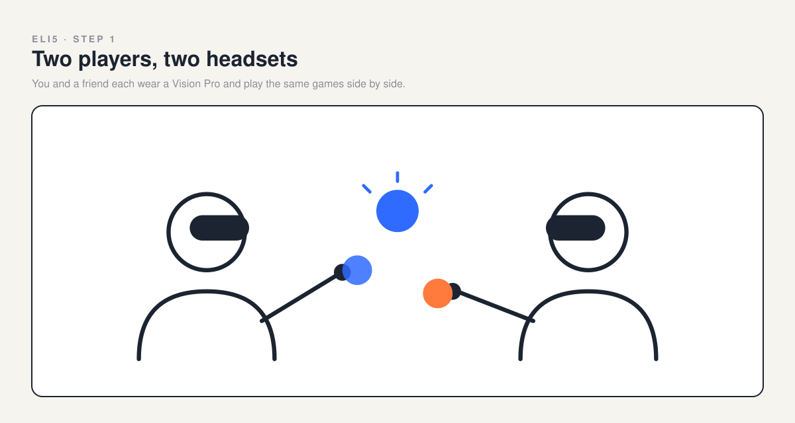
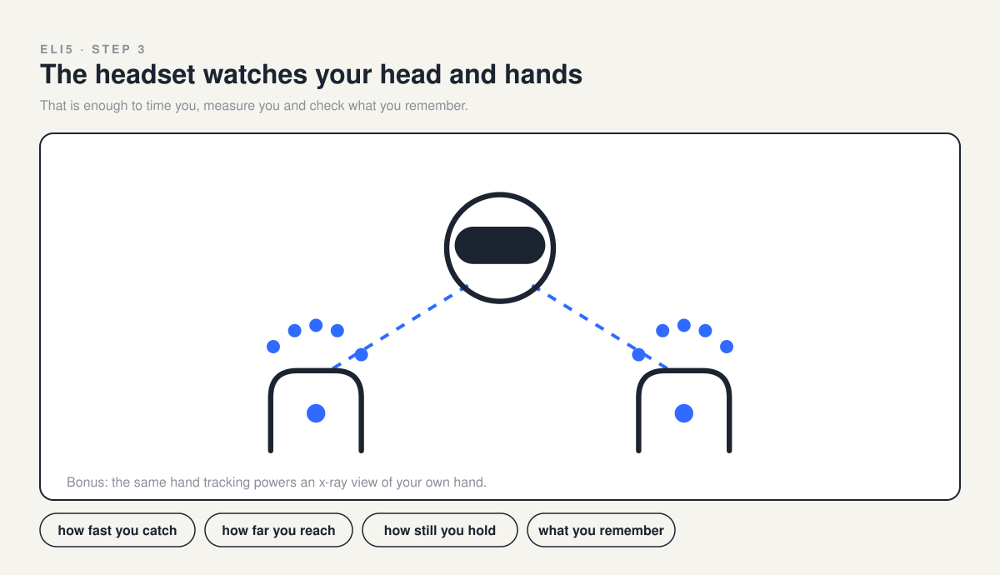
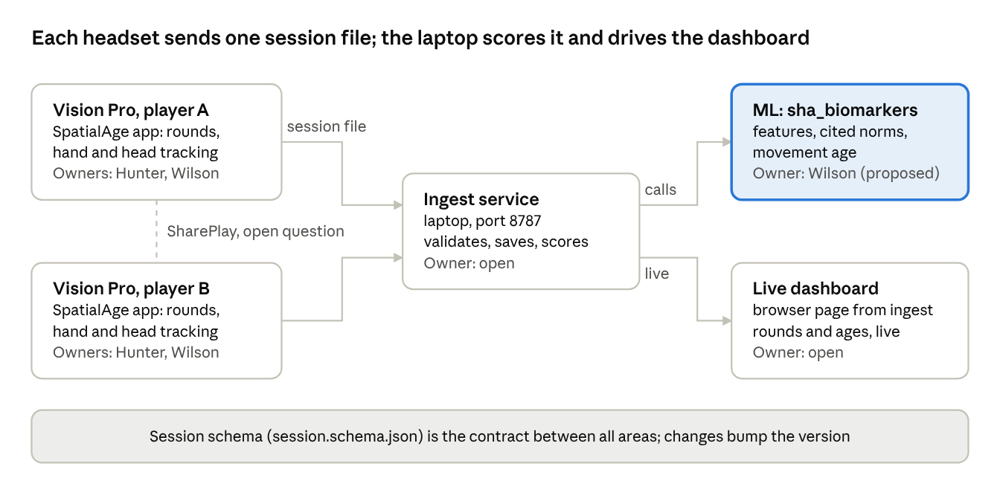
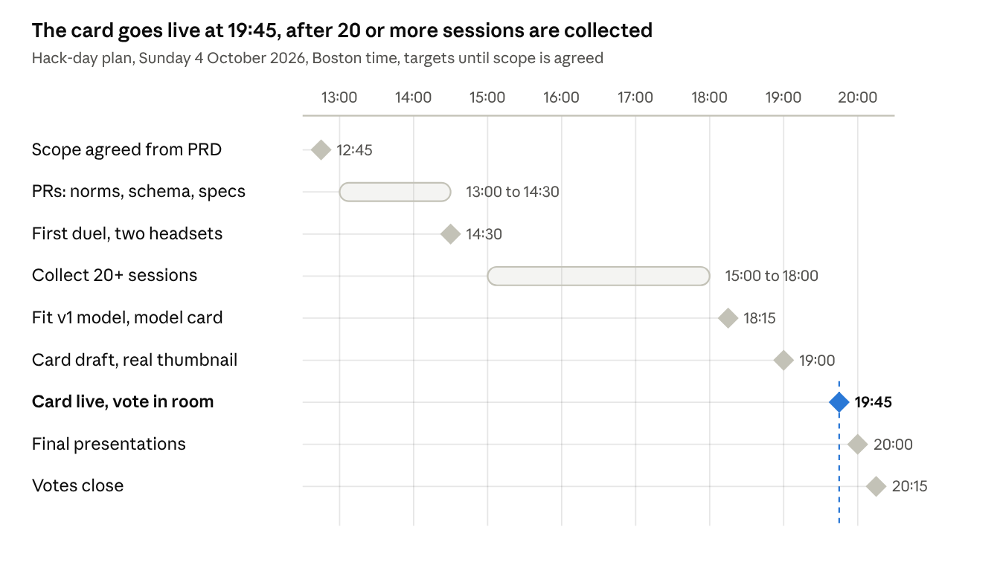

# Spatial Human Assessment PRD

Status: hackathon draft, v0.2 (4 October 2026), updated with the 12:27 to 12:37 team decisions. Builds on v0.1; its outputs, stretch goals, privacy rules, risks and workstreams are kept below. Concept deck: `concept/SpatialReactionMemory_Concept.pdf`.

## Summary (STAR)

**Situation.** Sundai Hack 143, Biomarkers of Aging, runs Sunday 4 October 2026, 10:00 to 22:00 at Harvard, as part of Boston Longevity Week ([event page](https://www.sundai.club/events/boston/sundai-hack-143-biomarkers-of-aging-hack), [Boston Longevity Hub](https://bostonlongevity.org/)). Teams formed at 11:00, card votes close at 8:15 PM, and final presentations start at 20:00. Most aging clocks need blood or a lab.

**Task.** Build, in one day, a Vision Pro game that estimates a player's movement age from how they move, and make it fun enough to repeat.

**Action.**

1. Hunter set up this repo: visionOS app, session schema, ingest service, Python age model and live dashboard.
2. Research lanes pulled published norms for reaction, reach, balance, chair stands and shoulder range, plus headset accuracy and claim limits.
3. Build in Xcode 26.2 with the visionOS 26.2 SDK: `brew install xcodegen`, set `DEVELOPMENT_TEAM` in `apps/vision/project.yml` locally, then `make app`. Command-line builds also need `sudo xcode-select -s /Applications/Xcode.app/Contents/Developer`.
4. Run on two paired Vision Pros with Developer Mode on, or on the visionOS simulator once its runtime is downloaded in Xcode settings.
5. Hunter shares a `mini-catalog` branch with the app shell. Every change goes on its own branch and merges by PR; schema changes bump the version.
6. Collect 20 or more sessions at the event, fit the v1 model, and post the card by 19:45.

**Result (target).** Two Vision Pros duel side by side. Each player sees their current movement age, and levelling up trains reaction, memory and balance, abilities linked to falls and mortality, moving them toward a younger movement age.

- **Card line (draft):** How old do you move? Two players, two Vision Pros, one 6-minute duel that scores your movement age against published norms.
- **Adds to v0.1:** the 12:00 brainstorm (head-to-head play, levelling up) and the 12:37 split: Hunter and Jason build the reaction game and a hand x-ray; Wilson, Alex and Franco build the memory and balance games; Jess owns the business use case, name and UI/UX; Ben owns the data set.
- **Movement age** is the player-facing name for the spec's `functional_age` field.
- **Team:** Jason and Hunter (idea leads; it is their Vision Pro work), with Jess, Wilson, Ben, Alex and Franco.

## ELI5: how it works

You play. The headset watches. We compare you with people of every age. The picture explainer is also a page: `docs/eli5/index.html`.

**1. Two players, two headsets.** You and a friend each wear a Vision Pro and play the same games side by side.

**2. Four quick games.** Each game checks one thing your body or brain does every day. Both balance games keep your feet on the floor.

**3. The headset watches your head and hands.** That is enough to time you, measure you and check what you remember.

**4. We find the age that matches you.** Scientists measured thousands of people of every age. Where your score lands is your movement age.

**5. Play again. Get better. Watch it drop.** Each duel saves your movement age, so you can see the number move as you level up.

## Answers to the team to-do list

Proposed answers from the 12:27 to 12:37 team discussion. Jess owns the name, business use case and UI/UX, so these are starting points for her.

| Question | Proposed answer | Why |
|---|---|---|
| Name | **SpatialAge**; alternatives: Movement Age, AgeDuel | It is already the app target in `apps/vision/SpatialAge`, so there is no rename. Check the App Store and trademarks before any launch |
| Branding | The concept deck look: warm paper, navy ink, blue for go targets, orange for no-go, Helvetica. Hook line: **How old do you move?** | It matches the figures already in the repo, and a question makes no health claim |
| Target audience | **Everyone:** anyone with a Vision Pro can play and duel friends. Clinics can also offer it, for example to patients in the waiting room | Open to every player, with clinics as an optional channel the team already knows; one clinic headset serves many patients |
| Business use case | Free to play for everyone, with the duel bringing players back. An optional clinic edition offers waiting-room assessment as a per-clinic subscription | Repeat visits give the trend that one test cannot. If clinicians use scores for care decisions, the product moves toward FDA device rules, so keep it framed as wellness and check with counsel |
| Final design | Four games in about 6 minutes: Catch the knives (reaction, Hunter), Color dots (memory and decisions, Wilson), Reach and grab plus Hole in the wall (reach and balance in the Wii Fit U style, Wilson, from alex's ideas). Bonus: hand x-ray (Hunter). The result screen shows movement age per game and overall, then level up | It matches the 12:37 split and the ELI5 loop above |
| Metrics (data) | Catch: reaction and movement time (ms), misses. Color dots: hits, false taps, misses, decision time (ms), head turn (degrees). Reach and grab: furthest object grabbed and head travel (cm). Hole in the wall: pose match, hand drift and head sway during each hold (cm), walls cleared. Per session: movement age per game and overall, valid trial rate | These fields go into the session schema; norm sources are in the Movement Age engine table |

## Team and ownership

Jason and Hunter lead the idea; it is their Vision Pro work.

| Person | Role | Owns | LinkedIn |
|---|---|---|---|
| Jason Morris | Idea lead | Works with Hunter: reaction games, the app shell, hand x-ray | [Medical Technology Specialist](https://www.linkedin.com/in/jason-morris-a803294/) |
| Hunter Harris | Idea lead | Reaction games, the app shell, hand x-ray, with Jason | [Featured iOS / visionOS Engineer - ARKit, RealityKit, SharePlay. 10+ Vision Pro Apps](https://www.linkedin.com/in/hunt3r-harris/) |
| Jessica Myles | Team | Business use case, name, UI/UX | [MBA Candidate at Harvard Business School · Ex-Doordash, Accenture](https://www.linkedin.com/in/jessica-myles/) |
| Wilson Wu | Team | Memory and balance games, PRD and research | [Building with AI · Founder, Dubbs Capital · CRO at Snappy · MSCS @ Georgia Tech](https://www.linkedin.com/in/wilson1wu/) |
| Alex Fu | Team | Memory and balance games; designed Scary Balance and Hole in the Wall; branding and the Games Ideas deck | [Non-Invasive Devices · BU Mechanical Engineering Student, focusing on Human-Machine Interaction and MedTech](https://www.linkedin.com/in/alex-fu-bu/) |
| Franco | Team | Memory and balance games | To add |
| Ben | Team | The data set; Vision Pro landscape research | To add |

Headlines are as shown on each LinkedIn profile on 4 October 2026.

## Problem

Reaction time, reach and balance predict falls and mortality, yet people measure them only in clinics and labs, with tests too dull to repeat. Blood and epigenetic clocks need a lab. Vision Pro already tracks hands, head and the room, so a short game can measure these anywhere.

| Evidence | Finding | Source |
|---|---|---|
| Reaction time | 1 SD slower reaction time: all-cause mortality HR 1.25, cardiovascular HR 1.36; 5,134 US adults aged 20 to 59 | [NHANES cohort](https://pmc.ncbi.nlm.nih.gov/articles/PMC3906008/) |
| Reach | Unable to reach: odds ratio 8.07 for recurrent falls; reach of 6 inches or less: 4.02; 217 men aged 70 to 104 | [Veterans reach cohort, 1992](https://pubmed.ncbi.nlm.nih.gov/1573190/) |
| Balance | Failing a 10-second one-leg stand: mortality HR 1.84; 1,702 adults aged 51 to 75 | [Araujo 2022, BJSM](https://pubmed.ncbi.nlm.nih.gov/35728834/) |
| Training | Stepping programs cut falls about 50% (rate ratio 0.48; 7 trials, 660 people) and improved stepping reaction time | [Okubo 2017 meta-analysis](https://pubmed.ncbi.nlm.nih.gov/26746905/) |
| Engagement | Competition raised daily steps the most of three game mechanics (920 more than control; 602 adults) and was the only lasting effect | [STEP UP RCT](https://pubmed.ncbi.nlm.nih.gov/31498375/) |

The link is association, not proof: no trial shows that raising these scores lowers mortality.

## Users and personas

Anyone can play: players duel friends wherever they have a Vision Pro. Clinics can also offer it to patients if they'd like.

| Persona | Who | Job to be done | What they get |
|---|---|---|---|
| Player (primary) | Adult who duels a friend anywhere | When I play a friend, I want to see whose movement age is younger and keep improving | Round wins, levels, a movement age |
| Clinic patient (optional) | Adult waiting for an appointment | While I wait, I want a quick game that shows how my reaction, memory and balance are doing | A movement age per game and progress since the last visit |
| Clinic staff (optional buyer) | Clinicians and front-desk staff | Get a repeatable movement check without extra appointment time | Trends between visits, never a diagnosis |
| Operator (hack day) | Team member running sessions | Start a duel fast and link sessions without names | Participant codes; age, sex and handedness entry; a consent screen |
| Audience (hack day) | Sundai voters | Follow the duel live | The AirPlay mirror plus the live dashboard |

## Goals and success metrics

**Primary metric:** 20 or more valid sessions collected at the event across a wide age range, each with a movement age.

| Secondary metric | Target |
|---|---|
| Full duel, start to result | 6 minutes or less |
| Session to features and movement age | Under 5 seconds |
| Model accuracy | Leave-one-out MAE reported next to a predict-the-mean baseline |
| Sundai card live with a real-frame thumbnail | By 19:45 |

**Guardrails:** sessions with a valid trial rate under 0.7 are flagged and excluded from training, and no names are stored.

**Non-goals:**

- Clinical claims, diagnosis or a biological age.
- Accounts, cloud storage and an App Store release.
- Raw gaze, which visionOS does not expose to apps.
- Upper-body strength, which needs a weight or a band.
- Finger-joint angles and tremor: finger-angle error was 9.6 degrees on Quest 2 ([source](https://pmc.ncbi.nlm.nih.gov/articles/PMC10830632/)), and no headset tremor validation was found.

## Product

**As built (17:00):** the catalog follows Alex's Games Ideas deck: Stick Drop (catch the falling leaf), Spatial Memory (the Color dots game, rebuilt to the deck's rules), Scary Balance (reach, lean and freeze while a creature passes), Hole in the Wall, and Spatial Tracking (react to sound and light). Gate, Constellation and Orbit still run but are not listed (`specs/games/README.md`). Stick Drop and Spatial Tracking play in a forest clearing, Hole in the Wall on a stone island with a moat, and a yellow canary companion lives in every scene. Ben's idea for a next memory game: hide objects such as a bird, a bottle and a coin in containers, show them for a few seconds, then ask where each one is; it also works with language flashcards.

**Alex's Games Ideas deck, as built** (`concept/Games Ideas (2).pdf`; code in `apps/vision/SpatialAge/Sources/Games/`):

| Deck idea | Code | What the player does (in-app text) | What it tests (deck) |
|---|---|---|---|
| Stick Drop | `pendulum` | Catch the falling leaf before it hits the ground. | Visual to action reaction time; useful field of view |
| Spatial Memory | `dots` | Touch the balls you are asked for. Then find the ones you did, or did not, touch. | Decision making time; spatial memory |
| Scary Balance | `reach` | Walk to the glowing spot and reach for the object. Freeze when the creature passes. | Reach and leaning; holding positions and shaking |
| Hole in the Wall | `wall` | Stay on the island. Make the shape in the wall and hold it as the wall passes. | Mobility: how far the arms move to fit the pose |
| Spatial Tracking | `spark` | Listen and look. Point at each falling leaf before it lands. | Audio and visual to action reaction time; locating the cue |

A duel is a set of short games in mixed reality. Both players run the same games, each game awards a point, and the result screen shows both movement ages. The headset sees the head and both hands only, so every game reads through them (`specs/architecture.md`).

| Game | Metric | What players do | What the headset measures | Owner |
|---|---|---|---|---|
| Warm-up | None | One unscored practice pass per game | Nothing scored | Each game's owner |
| Stick Drop | Reaction | Catch the falling leaf before it hits the ground | Movement onset and catch time, using the [simple reaction](specs/tasks/simple-reaction.md) timing rules | Hunter, Jason |
| Spatial Tracking | Reaction | Hear or see a leaf coming, then point at it before it lands | Audio and visual reaction time, and how fast the cue is found | Hunter, Jason |
| Spatial Memory | Memory and decisions | Colored balls of two sizes surround you; touch the ones the rule names, then the ones you did, or did not, touch | Hits, false taps, misses, decision time, how far you look around | Wilson, Alex, Franco |
| Scary Balance | Reach and holding still | Walk to a glowing spot, then reach for a cube with feet planted; the farthest ones need a lean. When a friendly creature drifts past, freeze until it is gone | Furthest grab and lean, in cm, plus head sway and hand drift during each freeze | Wilson, Alex, Franco |
| Hole in the Wall | Mobility and pose holding | Stay on the island; a wall with a cutout moves toward you; make the shape and hold it still as the wall passes | Pose match, hand drift and head sway during each hold, walls cleared | Wilson, Alex, Franco |
| Hand x-ray | Demo | A separate app that shows an x-ray view of your own hand | Hand skeleton from hand tracking | Hunter, Jason |
| Chair sprint, one-leg hold | Strength, balance | Not built today | Reps from head height; hold time | Unassigned |

- **Where the code goes:** Hunter shares a `mini-catalog` branch with the app shell that holds the games. Spatial Memory (was Color dots), Scary Balance (was Reach and grab) and Hole in the Wall (Wilson, Alex and Franco) landed on it as PRs. All five deck games are Alex's ideas; his freeze idea is now the creature in Scary Balance and the hold rule in Hole in the Wall.
- **Head-to-head:** two headsets in sync, or one headset taken in turns (open question). The same hardware for both players cancels device latency between them.
- **Levelling:** each duel earns XP. Each metric shows change against the player's own first session, and only changes larger than test-retest noise count.
- **Safe balance:** every reach and hold happens with both feet on the floor, so players find their limits before a fall. Scary Balance players walk only between spots, inside the immersive boundary. The design reference is the [Wii Fit U balance games](https://www.youtube.com/watch?v=ybKOF1_yLZg): players steer by shifting their weight. With no balance board, the headset's head position stands in for the center of balance; head position and force-plate sway agree only moderately to well, so the game calibrates on this headset.
- **One-leg hold:** left out for safety, although failing a 10-second stand carried mortality HR 1.84 ([Araujo 2022](https://pubmed.ncbi.nlm.nih.gov/35728834/)). It could return later with a spotter.
- **Strength and mobility:** strength is unassigned. Hole in the Wall now covers arm mobility and Scary Balance covers reach; neck rotation from headset orientation is a validated extra: ICC above 0.95 against motion capture ([source](https://pmc.ncbi.nlm.nih.gov/articles/PMC10747215/)).
- **Safety:** passthrough stays on, the floor stays clear, and one tap skips any game.

## Outputs

Per session from v0.1: reaction time, movement time, decision time, reaction time variability, commission and omission rates, Corsi span, reach time by target eccentricity, functional age, and age gap (functional minus chronological). Definitions live in `specs/features.md`. The new games add color-dot hits, false taps, misses and head turn; furthest grab distance; and pose match, hand drift, head sway and walls cleared during holds. Their feature definitions still need specs.

## Movement Age engine

Movement age combines published age slopes with an anchor measured on this headset. Published norms say how much each measure changes per decade, and event sessions set the starting point on Vision Pro. Lab norms cannot be read directly: simple reaction time averaged 0.48 s in VR against 0.27 s on a PC in the same 66 people ([source](https://pmc.ncbi.nlm.nih.gov/articles/PMC12976848/)), and Vision Pro hand tracking measured about 128 ms of latency on visionOS 1.1.1 ([Road to VR](https://roadtovr.com/apple-vision-pro-meta-quest-3-hand-tracking-latency-comparison/)).

1. **Score:** each feature becomes a z-score against the event's young-adult reference on this device.
2. **Convert:** the published slope for that measure turns the z-score into years.
3. **Combine:** movement age = reference age + the weighted mean of those years, as in `ml/sha_biomarkers/norms.py` v0. Every constant cites its source on the same line.
4. **Fit (v1):** ridge regression on event sessions, with leave-one-out CV and a linear bias correction (`specs/age-model.md`).

| Metric | Feature | Published norms | Status |
|---|---|---|---|
| Strength | 30 s chair-stand reps | [Colombian multicenter 2025](https://pubmed.ncbi.nlm.nih.gov/42183074/): percentiles by sex in six bands from 18-29 to 70-80. Its equation, reps = 26.458 - 0.171 x age - 1.394 x sex, has R2 0.258, so a chair-stand age alone is noisy | Verified |
| Balance | Hole in the Wall and Scary Balance: hand drift and head sway during holds and freezes | [Posturography sway norms](https://pmc.ncbi.nlm.nih.gov/articles/PMC12926707/): 250 adults in five bands from 25-40 to 76-80. These are force-plate numbers, so the headset needs its own calibration | Pending |
| Reach | Scary Balance: furthest grab, cm | [Nakhostin-Ansari 2022](https://pmc.ncbi.nlm.nih.gov/articles/PMC9422043/): functional reach in six bands from 18-29 to 70+ | Verified |
| Reaction | Simple and choice reaction time, decision time | [Tap reaction time on a Wii Balance Board](https://pmc.ncbi.nlm.nih.gov/articles/PMC5747451/): percentiles by sex per decade from 20-29 to 80+, 354 adults. Slopes: choice reaction time rose 2.80 ms a year from 18 to 65 ([1,466 adults](https://pmc.ncbi.nlm.nih.gov/articles/PMC4407573/)); simple reaction time averaged 290, 318 and 354 ms at ages 30, 50 and 69 ([2,196 adults](https://pmc.ncbi.nlm.nih.gov/articles/PMC5608941/)). Use slopes, never lab milliseconds | Verified |
| Mobility | Arm or neck angle, degrees | [Shoulder range norms](https://pmc.ncbi.nlm.nih.gov/articles/PMC7549223/): flexion, abduction and external rotation by sex in 5-year bands from 20-24 to 85+, 2,404 adults; right flexion fell 43 degrees in men. No headset arm-angle validation found | Pending |
| Memory | Spatial Memory recall: hits, false taps, decision time | Not yet searched. Decision time can borrow the choice reaction slope above | Pending |

**Level-up curve:** a metric counts as improved only when it beats the player's own baseline by more than test-retest noise. A Quest 3 reaction task had single-trial ICC 0.80 to 0.88, and mixed and full VR scores differed by up to about 110 ms, so each player is compared in one environment ([source](https://pmc.ncbi.nlm.nih.gov/articles/PMC13568001/)).

**Age model v0.2 (as built):** a Klemera-Doubal estimate in `ml/sha_biomarkers/kdm.py` combines one biomarker per construct, weighted by how strongly each changes with age relative to its noise, with literature priors per entry until event sessions refit them (`specs/age-model.md`). Ben's reference set: Woods 2015 simple reaction time ([PMC4374455](https://pmc.ncbi.nlm.nih.gov/articles/PMC4374455/)), Woods 2015 choice reaction time ([PMC4407573](https://pmc.ncbi.nlm.nih.gov/articles/PMC4407573/)), Deary and Ritchie 2016 processing speed at 70 and 83 ([PMC4796023](https://pmc.ncbi.nlm.nih.gov/articles/PMC4796023/)), Nakhostin-Ansari 2022 functional reach and balance ([PMC9422043](https://pmc.ncbi.nlm.nih.gov/articles/PMC9422043/)), and Chilean functional fitness norms for older adults 2025 ([PMC12209290](https://pmc.ncbi.nlm.nih.gov/articles/PMC12209290/)).

**Age signal per test:** the table shared with Alex's files lists, for 12 published tests, how many years of aging move a score by one person-to-person standard deviation (the spread at a given age divided by the change per year). That ratio is the per-test term in the Klemera-Doubal formula, so a smaller number means one test says more about age. Its [1] to [5] tags are Ben's references above. The choice reaction (2.8 ms a year) and functional reach (0.25 cm a year) slopes match sources this PRD already verified; the other rows are as shared.

| Test | Ages | Years per SD | Ref | Closest game (our mapping) |
|---|---|---|---|---|
| Simple reaction time (lab) | 18 to 65 | 49 | [1] | Stick Drop, Spatial Tracking |
| Choice reaction time | 18 to 65 | 25 | [2] | Gate, Spatial Memory decisions |
| Simple reaction time | 70 vs 83 | 24 | [3] | Stick Drop, Spatial Tracking |
| Choice reaction time, 4 choices | 70 vs 83 | 10 | [3] | Gate |
| Digit Symbol (processing speed) | 70 vs 83 | 11 | [3] | None yet |
| Inspection time | 70 vs 83 | 16 | [3] | None yet |
| Functional reach | 20s to 70+ | 30 (women 18) | [4] | Scary Balance |
| 30 s chair stand | 60s to 80s | 20 to 23 | [5] | Not built |
| Timed Up and Go | 20 to 65 | 50 | [4] | Not built |
| Timed Up and Go | 65 to 75 | 7 | [4] | Not built |
| Timed Up and Go with mental arithmetic | 65 to 75 | 8.5 | [4] | Not built |
| Single-leg stance | 55 to 75 | 11 | [4] | Left out for safety |

- **Not the app's accuracy:** the same test reads very differently by age window (Timed Up and Go: 50 at 20 to 65, 7 at 65 to 75), and the reaction tests share error, so they do not combine as if independent.
- **For the demo:** if most players tonight are in their 20s and 30s, single tests are at their weakest there. The card quotes `evidence_age` error against a predict-the-mean baseline, never a number from this table.

## Requirements and user stories

**Epic hypothesis:** we believe a head-to-head duel that scores a movement age will get people to repeat a functional assessment, because competition was the strongest game mechanic and the only lasting one in a 602-person trial. It works if 20 or more event sessions produce a valid movement age and 5 or more players come back for a second duel.

**1. Start a duel.** As an operator, I want to enter two players and start a duel, so sessions link without names.

- [ ] Random participant codes; age, sex and handedness entered; no names stored
- [ ] Consent screen before the first game
- [ ] Session JSON validates against `packages/schema/session.schema.json`

**2. Catch duel.** As a player, I want to catch falling knives before my opponent, so reaction time feels like a game.

- [ ] Reaction time = hand movement onset minus drop start; movement time = onset to catch
- [ ] Trials with a tracking gap over 100 ms are dropped
- [ ] The first clean catch wins the point

**3. Balance games.** As a player, I want a safe way to see how far I can reach and how still I can hold, long before balance becomes a fall.

- [ ] Reach and grab: virtual objects sit at growing distances and a tap picks each up, feet planted; score = furthest object grabbed, in cm
- [ ] Hole in the wall: a wall with a cutout moves toward the player; head and hands must match the cutout and hold still until it passes; moving past a sway threshold hits the wall; score = pose match, hand drift, head sway and walls cleared
- [ ] One tap skips a game for anyone unsteady

**4. Color-dot memory.** As a player, I want to remember which colored dots appeared around me and tap only those, so one game checks memory, looking around and decisions.

- [ ] Dots appear around the room, some behind the player, so finding them takes a head turn
- [ ] Every dot tapped or skipped is logged: hits, false taps and misses
- [ ] Decision time and how far the head turned are logged per dot

**5. Movement age result.** As a player, I want my movement age per game and overall, so I know where I stand.

- [ ] Each game shows its value, its movement age and its norm source
- [ ] Wording says movement age and game score, never biological age or a health claim
- [ ] The result appears within 5 seconds of the last game

**6. Level up.** As a returning player, I want to see progress against my first session, so improvement feels real.

- [ ] Change shows only when larger than test-retest noise
- [ ] XP and level are stored by participant code only

**7. Live dashboard.** As an audience member, I want to follow the duel live.

- [ ] Last reaction time shown large, plus both players' game scores
- [ ] Under 500 ms lag on local wifi (`specs/dashboard.md`)

**Constraints:** Vision Pro gives head and hand tracking only, with no body or gaze data. Headset pose error averaged 0.52 cm relative and 3.62 cm absolute against motion capture ([preprint](https://arxiv.org/html/2508.08642v1)), so reach and sway are scored relative to the start pose. No Vision Pro fingertip accuracy figure was found; Quest 2 measured 1.1 cm ([source](https://pmc.ncbi.nlm.nih.gov/articles/PMC10830632/)).

## Strategic context and guardrails

Movement age is a game score against published norms. It is not a biological age, a diagnosis or a health claim.

**Precedent:** Wii Fit already showed players a Wii Fit Age on a 2 to 99 scale, where 46 meant the balance of an average 46-year-old ([review](https://pubmed.ncbi.nlm.nih.gov/24507245/)). Nintendo lists Wii Fit at 22.67 million units ([Nintendo IR](https://www.nintendo.co.jp/ir/en/sale/software/wii.html)). The same review found Wii Fit's software balance scores far less effective at judging balance, so ours must be checked against reference measures.

**Opening:** no head-to-head fitness game was found on Vision Pro. Quest already has live player-vs-player fitness ([ChallengeBox Fitness](https://www.meta.com/experiences/challengebox-fitness/7677012659036198/), store listing, not code-verified), so we stand apart on the measured movement age.

| We can say | We cannot say |
|---|---|
| Your reaction time matches a typical 34-year-old's on this test | You are biologically 34 |
| Slower reaction time is linked to higher mortality in large cohorts | Playing lowers your mortality |
| Balance training cut falls in trials of older adults | This game prevents falls |
| A general wellness game for staying active | It diagnoses, treats or prevents any disease |

**Why the line sits there:** FDA's general wellness policy covers healthy-lifestyle software unrelated to diagnosing or treating disease ([FDA](https://www.fda.gov/regulatory-information/search-fda-guidance-documents/general-wellness-policy-low-risk-devices)). The FTC made Lumosity pay $2 million, with a $50 million judgment suspended, over claims its games delay age-related decline ([FTC](https://www.ftc.gov/news-events/news/press-releases/2016/01/lumosity-pay-2-million-settle-ftc-deceptive-advertising-charges-its-brain-training-program)). This is not legal advice; get counsel before anything ships beyond the hack.

## Architecture and ownership

Data flow is in `specs/architecture.md`: each headset posts one session file to the ingest service on the laptop (port 8787), which scores it with `ml` and streams results to the dashboard. Whether the two headsets sync through SharePlay is an open question. Owners are proposed until the team confirms them. Hunter's merged catalog already holds Pendulum, Spark, Gate, Constellation and Orbit (`specs/games/`).

| Area | Path | Spec | Owner (proposed) |
|---|---|---|---|
| App shell (`mini-catalog`), reaction game, hand x-ray, two-player sync | `apps/vision` | `specs/tasks/*`, `specs/architecture.md` | Hunter, Jason |
| Color dots, Reach and grab, Hole in the wall | `apps/vision` | `specs/games/` | Wilson, Alex, Franco |
| Name, business use case, UI/UX | `apps/vision/SpatialAge/Sources/Catalog`, `Design` | `specs/games/design.md` | Jess |
| Data set | `data/` | `specs/age-model.md` | Ben |
| Session contract | `packages/schema` | `specs/session-schema.md` | Shared |
| Features, cited norms, movement age | `ml` | `specs/features.md`, `specs/age-model.md` | Wilson |
| Ingest service | `services/ingest` | `specs/architecture.md` | Open |
| Live dashboard | `apps/dashboard` | `specs/dashboard.md` | Open |

The schema is the contract between all areas. Changing it needs a version bump and a note in `specs/session-schema.md`.

## Build resources

Open-source code that makes the games look and feel real, checked through the GitHub API on 4 October 2026. Rebuild Wii Sports-style mechanics from scratch; never copy Nintendo's assets or code.

| Resource | What it gives us | Use it for |
|---|---|---|
| [Dicyanin packages](https://github.com/hunterh37/DicyaninPackages) (Hunter, about 40, mostly MIT) | Hunter's visionOS toolkit | Everything below; ask Hunter what is already in the app |
| [DicyaninHandTracking](https://github.com/hunterh37/DicyaninHandTracking), [DicyaninHandGesture](https://github.com/hunterh37/DicyaninHandGesture), [DicyaninGrabbableObject](https://github.com/hunterh37/DicyaninGrabbableObject) | Hand tracking, gesture detection, grabbable objects | Reach and grab, Catch |
| [DicyaninMultiPeer](https://github.com/hunterh37/DicyaninMultiPeer), [DicyaninSharePlay](https://github.com/hunterh37/DicyaninSharePlay) | Game state synced across headsets in one room | Head-to-head duels |
| [RealityHD](https://github.com/hunterh37/RealityHD), [DicyaninRagdoll](https://github.com/hunterh37/DicyaninRagdoll), [DicyaninSceneReconstruction](https://github.com/hunterh37/DicyaninSceneReconstruction) | Photoreal props and scenes, ragdoll physics, collisions with the real room | Realism |
| [DicyaninMockHandTracking](https://github.com/hunterh37/DicyaninMockHandTracking), [DicyaninSimulatorInput](https://github.com/hunterh37/DicyaninSimulatorInput) | Simulated hand input | Testing without a headset |
| [HandVector](https://github.com/XanderXu/HandVector) (202 stars, MIT) | Hand-pose similarity scoring and simulator hand-tracking tests | Hole in the wall pose matching |
| [HandGesture](https://github.com/johnhaney/HandGesture) (44 stars, MIT) | Semantic gestures from hand tracking | Swings and throws |
| [visionOS_30Days](https://github.com/satoshi0212/visionOS_30Days) (2,236 stars, MIT) | 30 small visionOS demos: particles, physics, hand tracking | Fast effects |
| Apple samples: [Happy Beam](https://developer.apple.com/documentation/visionos/happybeam), [Swift Splash](https://developer.apple.com/documentation/visionos/swift-splash), [BOT-anist](https://developer.apple.com/documentation/visionos/bot-anist) | Apple's own visionOS games | Reference patterns |
| [awesome-visionOS](https://github.com/tomkrikorian/awesome-visionOS) (377 stars, updated June 2026) | Maintained resource list | Anything else |

Most of the realism comes from RealityKit itself: grounding shadows, image-based lighting, physics bodies and spatial audio.

**From Ben's landscape** (`research/bw2_vision_pro_health_games_landscape_and_gaps.html`): none of the apps listed are open source, so none can be forked. Spatial Boxing Pro is Hunter's own (Veep LLC), so its code is ours to reuse. The one forkable base is Stanford's [ResearchKit](https://github.com/StanfordBDHG/ResearchKit) under a BSD-style license: its core runs on visionOS for consent and surveys, while its active tasks (reaction time, range of motion, the nine-hole peg test) are iOS-only, so we port their protocols, not their code.

## Design system

Jess and Alex own the look. Alex's branding deck (`concept/Branding (1).pdf`) is the brief, and Hunter's Dusk theme (`Theme.swift`, `concept/SpatialAge_Dusk_Design_Spec.pdf`, `specs/games/design.md`) builds it: Dusk tokens, glass components, a sunset stage and a dashboard. Every game takes its colors from `Theme.swift` and its feedback from five shared micro-interactions, so a re-skin is one token edit, not eight game edits. The results screen calls the score the BetterYears Age, so the final name is Jess's call.

**Brand brief (Alex's deck):**

- **Mood:** "Peaceful, Wellness": a simple UI that suits older players and a calming background. References: Oura, Calm, and other clean meditation and fitness apps.
- **Premium feel:** clean and minimal, "No AI Slop." Menus glow in the Vision Pro style.
- **Background:** a 3D nature scene that never competes with the game and feels like a real place as you move.
- **Simple UI:** large buttons, the most used in the center and the rest at the side; short instructions and an optional practice round before every game.
- **Music:** calm lofi made with Suno that loops without sounding repetitive; sound effects in the same premium style.

**Palette, measured:** the five swatches on the deck's Colors slide ("Peaceful, serene, restorative, calming, health-focused") match Dusk tokens almost exactly. Swatch colors were sampled from the slide image in code.

| Swatch on the slide | Dusk token | Token hex |
|---|---|---|
| #FDDDB7 pale peach | `accent` | #FBDAB4 |
| #D8AD8D tan | `accentStrong` | #D8AB8B |
| #9E8C8C mauve grey | `mute` | #A89698 |
| #4D4B4E charcoal | `hill` | #4E4B51 |
| #21201E near black | `onAccent` | #252322 |

- **Greens not adopted:** another copy of the deck, with less text, also shows five greens (#D9F8CF, #B4EEA1, #91E177, #6FCD51, #4FB230). The repo copy does not, and Dusk does not use them. As text on white menus all five fail 4.5:1 (1.1 to 2.7:1); on the Dusk background they pass (6.4 to 15.2:1).
- **Signal colors stay:** go #2F6BFF (touch it), nogo #FF7A3D (leave it, which also changes shape so color is never the only cue), gold #FFC83D (memory items) and teal #14B8A6 (moving targets). Scene lighting must not tint them; targets go unlit or emissive if it does.
- **One object family:** spheres to touch, rounded cubes to grab, rings to hold, all with the same glowing rim.
- **One module frame:** every game opens with the same intro card (title, one instruction, a ghost-hands demo from Hunter's DicyaninGestureTipGhostHands) and an optional practice round, and ends on the same results card.
- **Type and motion:** SF Pro throughout, which suits the calm brief; 150 to 300 ms spring motion, exits faster than entrances, and Reduce Motion respected.

**Environment: Dusk Meadow (Alex, baked 17:27, not yet in the repo).** A stylised forest clearing at dusk, calm and uncluttered rather than photoreal: lavender sky, a low peach sun, soft trees around a level lawn. It answers the brief's background slide.

- **Built for the headset:** everything past 60 m is one baked panorama; only the ground, trees, bushes, pebbles and grass within 60 m are real 3D, about 470k triangles against a 500k budget, with 90 fps still to confirm on device.
- **One integration:** it replaces the dark sky and floor grid in `Stage.make()`, which every game shares, and the stage still hides in passthrough.
- **Rules:** signal colors render unchanged, nothing bright or moving within 0.35 to 0.9 m of the player, and no ambient motion during scored trials (the export is static).
- **Open:** the sun sits 38 degrees left and 7 degrees up, where Spatial Tracking and Gate targets can land, so rotate the scene or re-bake if contrast suffers. A second headset needs its own copy at its own origin.

## Hack-day plan

Times are Boston time and stay targets until the team confirms them.

| Time | Milestone |
|---|---|
| 12:45 | Scope agreed (done at 12:37) |
| 13:00 to 14:30 | PRs: games on `mini-catalog`, schema, norms |
| 14:30 | First duel on two headsets |
| 15:00 to 18:00 | Collect 20+ sessions |
| 18:15 | Fit the v1 model and write the model card |
| 19:00 | Card draft with a real-frame thumbnail |
| 19:45 | Card live; team in the room voting |
| 20:00 | Final presentations |
| 20:15 | Votes close |

The 19:45 card time follows Wilson's analysis of the public Sundai projects API. At Hack 142, 64 of 67 likes landed between 19:49 and 20:20, and cards without a thumbnail reached the top 3 only 1% of the time.

## Stretch

HealthKit join (resting HR, HRV, VO2 max) where the participant consents. Head-turn kinematics. Test-retest on 5 participants.

## Privacy

No names. A random participant code links sessions. Data stays on the operator laptop under `data/`, which git ignores. Consent screen before the first task.

## Risks and open questions

| Risk | Mitigation |
|---|---|
| Headset reaction time runs slower than lab tests: 0.48 s in VR against 0.27 s on a PC | Anchor on this device and use published slopes only |
| Vision Pro hand-tracking latency, about 128 ms on visionOS 1.1.1 | Same hardware for both players; re-measure on visionOS 26 |
| Hand tracking dropouts | Log tracking state per frame, drop trials with gaps over 100 ms |
| A player loses balance during the balance games | Feet planted for every reach and hold, walking only between Scary Balance spots inside the immersive boundary, clear floor, one-tap skip |
| Third-party images in the public repo: the branding and games decks reuse designer mockups (one credited to Marina Minchukova), a PAPERHEARTDESIGN.COM palette photo and a game-show photo | Keep them as internal mood boards, or replace them with our own screenshots before the repo is promoted |
| Wellness wording reads as a health claim | Every surface that says wellness also says movement age is a game score against published norms, not a medical test |
| Practice effects inflate repeat scores | Fixed warm-up; level-ups only beyond test-retest noise |
| A small sample overfits the v1 model | Few features, ridge regression, literature priors, leave-one-out CV |
| Room too small for placement | Fallback spawn shell 0.4 to 0.7 m around the user |
| Claims drift on the card | Use the wording table in Strategic context and guardrails |
| Session data in a public repo | `data/` stays git ignored; random codes only, no names |

**Open questions**

- [ ] Confirm the proposed name, branding, audience and business use case above
- [ ] Menus: the brief says white with black text, while Dusk ships dark glass with light text. Jess and Alex pick one
- [ ] Music: which Suno plan, since the right to use generated tracks depends on the plan
- [ ] Who integrates Dusk Meadow into `Stage.make()`, and on whose machine it builds
- [ ] Two headsets in sync through SharePlay, or one headset taken in turns?
- [ ] Repo access for Jess (GitHub jess-myles)
- [ ] Who leads the Sundai card, and which real frame becomes the thumbnail?
- [ ] Age norms for color-dot memory, searched before the age engine scores it
- [ ] Hand-tracking latency on visionOS 26, measured before trusting absolute reaction times

## Sources

Sources are linked where they are used. In a code check, 22 of 24 quotes from today's research matched their sources. The Quest 2 accuracy quote was then confirmed against its Europe PMC abstract. The ChallengeBox store page blocks scripted fetches. Event facts and the chair-stand, balance and reach norms come from an earlier verified research run the same morning. The ELI5 diagrams use the concept deck's style; the age line in Fig B plots the three published cohort means, and its example player is illustrative.
