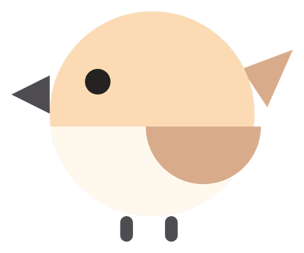

<p align="center"></p>

# BetterYears Age (Spatial Human Assessment)

Eight Vision Pro minigames that measure reaction, decisions, reach, balance and spatial memory, and turn them into one movement age. Read `PRD.md`, then the spec for the area you work on in `specs/`. Games: `specs/games/`. Score: `specs/score.md`.

## How it works

**How old do you move?** Put on a Vision Pro and play eight quick games. The headset tracks head and hands, each score is compared with published results from people of every age, and the age you match is your movement age. Play again, level up, and watch it drop, then compare scores with friends on the leaderboard. Movement age is a game score against published norms, not a medical test.


All eight games are on `main` and in the app's Games grid. Names and lines are the in-app copy from `packages/ScoreKit/Sources/ScoreKit/Model/Game.swift`.

| Game | What you do | Measures | Built by |
|---|---|---|---|
| Stick Drop | Catch the falling leaf before it hits the ground. | Visual reaction time and useful field of view | Hunter, Jason |
| Spatial Tracking | Listen and look. Point at each falling leaf before it lands. | Audio and visual reaction time and localization | Hunter, Jason |
| Gate | Touch blue as fast as you can. Leave orange. | Decision time and inhibition | Hunter, Jason |
| Constellation | Watch the stars light, then touch them in order. | Spatial working memory span | Hunter |
| Orbit | Keep your fingertip inside the moving light. | Visuomotor tracking error and lag | Hunter |
| Scary Balance | Walk to the glowing spot and reach for the object. Freeze when the creature passes. | Reach, lean and holding still | Alex (design), Wilson, Hunter |
| Hole in the Wall | Stay on the island. Make the shape in the wall and hold it as the wall passes. | Arm mobility and pose holding | Alex (design), Wilson, Hunter |
| Spatial Memory | Touch the balls you are asked for. Then find the ones you did, or did not, touch. | Decision time and spatial memory | Alex (design), Wilson, Hunter |

**Situation.** Sundai Hack 143, Biomarkers of Aging, Harvard, Sunday 4 October 2026. Most aging clocks need blood or a lab.
**Task.** Build, in one day, a Vision Pro game that estimates movement age from how people move.
**Action.** A shared session schema, the visionOS minigame catalog, ScoreKit for scoring, and research-backed norms, built by PR on this repo.
**Result.** Each player plays solo in a calm 3D forest clearing, sees a movement age with an 80% interval, levels up as it drops, and compares scores with friends on the leaderboard.

**Team:** Jason and Hunter lead the idea and each brought a Vision Pro; they build the app, the reaction games and the hand x-ray. Alex designed the brand, the Games Ideas deck, the Dusk spec and the Dusk Meadow, and made the Better Years Calm track (#27). Franco built the Klemera-Doubal age model and pipeline. Jess owns the business use case, the name and UI/UX. Ben mapped the Vision Pro app landscape and the age-norm references. Wilson wrote the PRD and research and built the first memory and balance games and the branding PRs. LinkedIn links are in the PRD under Team and ownership.

The full plan, sources and guardrails are in [PRD.md](PRD.md); the picture explainer is `docs/eli5/index.html`.

## Repo layout

```
apps/vision        visionOS app (Swift, XcodeGen)
apps/dashboard     live audience dashboard (web)
services/ingest    receives sessions from the headset, pushes to dashboard
ml                 feature extraction and age model (Python)
packages/schema    session JSON schema and examples, shared by all
packages/ScoreKit  Swift scoring: metrics, norms, Spatial Age, pace of aging, CLI
showcase           showcase PDF and its build script
specs              specs per area
concept            original concept deck and figures
data               local session files, git ignored
```

Quick start without a headset:

```
make sample     # write synthetic sessions to data/synthetic
make features   # print features for each synthetic session
make test
```

Rules: branch per change, PR into `main`, one area per PR where possible. Schema changes need a version bump.
