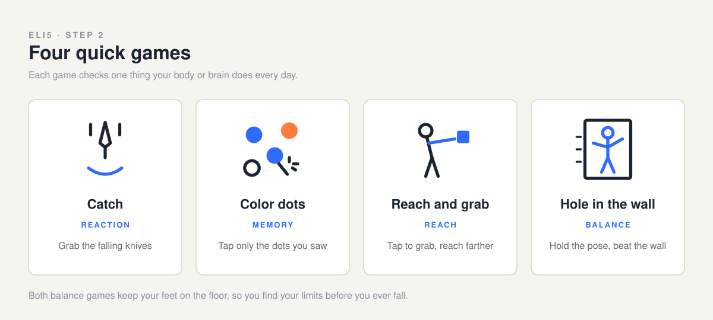
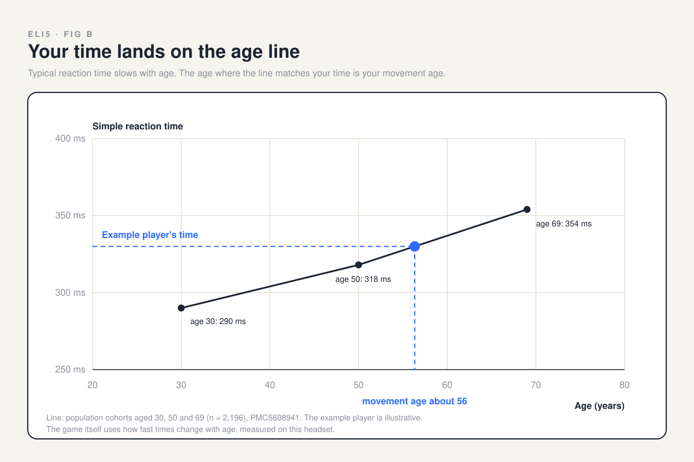
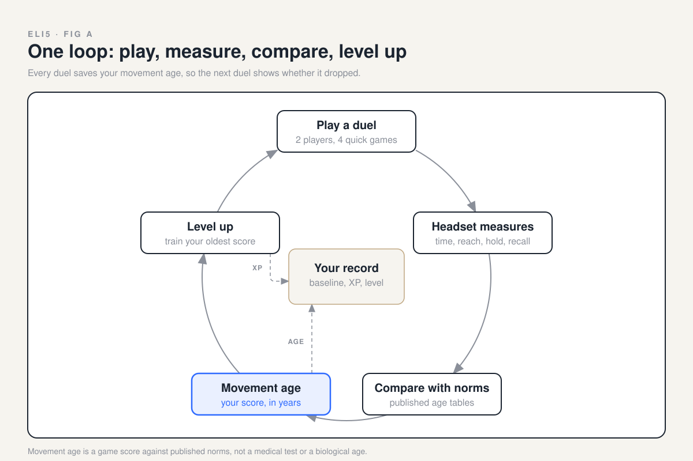

# Spatial Human Assessment

Five Vision Pro minigames (Pendulum, Spark, Gate, Constellation, Orbit) that measure reaction, reach and spatial memory as a functional aging biomarker. Read `PRD.md`, then the spec for the area you work on in `specs/`. Games: `specs/games/`. Score: `specs/score.md`.

## How it works

**How old do you move?** Two players put on Vision Pros and play quick games side by side. The headset tracks head and hands, each score is compared with published results from people of every age, and the age you match is your movement age. Play again, level up, and watch it drop. Movement age is a game score against published norms, not a medical test.







| Game | Measures | Owner | Status |
|---|---|---|---|
| Pendulum, Spark, Gate | Reaction and decisions | Hunter, Jason | On `main` |
| Constellation | Spatial memory | Hunter | On `main` |
| Orbit | Hand tracking control | Hunter | On `main` |
| Color dots | Memory and decisions | Wilson, Alex, Franco | In progress |
| Reach and grab | Reach and mobility | Wilson, Alex, Franco | In progress |
| Hole in the wall | Balance and stability | Wilson, Alex, Franco | In progress |

**Situation.** Sundai Hack 143, Biomarkers of Aging, Harvard, Sunday 4 October 2026. Most aging clocks need blood or a lab.
**Task.** Build, in one day, a Vision Pro game that estimates movement age from how people move.
**Action.** A shared session schema, the visionOS minigame catalog, ScoreKit for scoring, and research-backed norms, built by PR on this repo.
**Result (target).** Two Vision Pros duel side by side; each player sees a movement age and can level up toward a younger one.

**Team:** Jason and Hunter (idea leads) build the reaction game, app shell and hand x-ray. Wilson, Alex and Franco build the memory and balance games. Jess owns the business use case, name and UI/UX. Ben owns the data set.

The full plan, sources and guardrails are in [PRD.md](PRD.md); the picture explainer is `docs/eli5/index.html`.

## Repo layout

```
apps/vision        visionOS app (Swift, XcodeGen)
apps/dashboard     live audience dashboard (web)
services/ingest    receives sessions from the headset, pushes to dashboard
ml                 feature extraction and age model (Python)
packages/schema    session JSON schema and examples, shared by all
packages/ScoreKit  Swift scoring: metrics, norms, Spatial Age, pace of aging, CLI
showcase           showcase PDF and its build script
specs              specs per area
concept            original concept deck and figures
data               local session files, git ignored
```

Quick start without a headset:

```
make sample     # write synthetic sessions to data/synthetic
make features   # print features for each synthetic session
make test
```

Rules: branch per change, PR into `main`, one area per PR where possible. Schema changes need a version bump.
