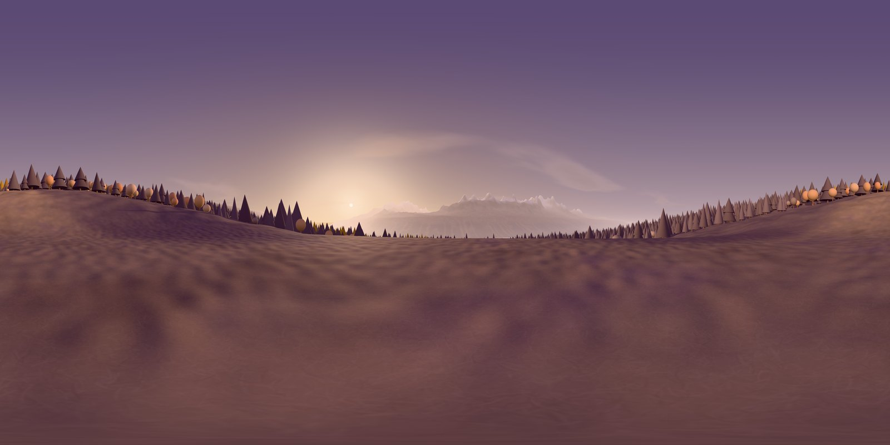

# DuskEnvironment

The immersive background for every SpatialAge game: a soft, minimal storybook forest clearing at dusk. Smooth cone and round trees in the Dusk palette (slate-mauve, tan, peach) ring a level lawn, under a lavender sky with a low peach sun and pale peaks beyond. It is stylised on purpose: calm, bright and uncluttered, not photoreal. The ground is flat for 13 m around the standing spot. It follows the Dusk design spec (`concept/SpatialAge_Dusk_Design_Spec.pdf`).

**If you are the Claude integrating this, start here.** Your job: replace the dark sky and floor grid in `apps/vision/SpatialAge/Sources/Stage/Stage.swift` with this environment. `Stage.make()` builds the one stage that `ImmersiveView` shows behind all eight games, so a single integration covers every game.



## Files

| Path | What it is |
|---|---|
| `reference/dusk-meadow.html` | The look you are matching. Open it in Chrome or Safari (it loads three.js from jsDelivr, so it needs internet). Drag to look around, `H` hides the panel. It also regenerates everything in `Resources/` (see Re-baking). |
| `Resources/manifest.json` | Read this first. Every file, unit, layout, the sun, the sky colours and the instance sets. |
| `Resources/dusk_far_8192x4096.jpg` | Equirect panorama of the sky, sun, clouds, mountains, lake, forest and all ground, seen from the standing spot. Objects closer than 60 m are left out. Trees are only placed out to 2.5 km; beyond that the dark forest ground and haze carry the forest, which keeps the reference page light. Already tone mapped, sRGB. |
| `Resources/dusk_ibl_1024x512.jpg` | The same panorama, small, for image-based lighting. |
| `Resources/near_height_241.f32` | Ground height within 60 m: 241 × 241 float32, 0.5 m spacing, x and z from -60 to +60. |
| `Resources/near_albedo_1024.png` | Ground colour for the same square. Alpha is 1 inside 48 m and fades to 0 at 60 m. |
| `Resources/near_instances.f32` | Every tree, bush, pebble and grass card within 60 m: 41,245 records of 13 float32 (position, rotation quaternion, scale, linear RGB tint). Sets and offsets are in the manifest. |
| `Resources/prototypes.json` | The 17 meshes those instances use (positions, normals, per-vertex shade, indices, uvs for the grass card). Local space, base at y = 0. |
| `Resources/grass_card.png` | Alpha-tested blade texture for the `grass_card` prototype (alpha test 0.42). |

Frame and units match RealityKit's immersive space: metres, +Y up, -Z forward, origin on the ground at the standing spot (ground y = 0, eye 1.6 m).

## Why it is split this way

Players stand in place, and head movement stays within about half a metre. From that spot, anything farther than about 60 m shows no visible parallax. Only the nearest things are real 3D; the rest costs one textured sphere. So everything distant is baked into one panorama, and only the near field (ground, nearby trees, rocks, grass) is real 3D. That keeps the headset cost small, and the panorama already has the exact sky, haze and lighting from the reference.

## Integration plan

1. **Bundle the resources.** Add `packages/DuskEnvironment/Resources` to the app target in `apps/vision/project.yml` as a folder reference, then run `make app`:
   ```yaml
   sources:
     - SpatialAge/Sources
     - path: ../../packages/DuskEnvironment/Resources
       type: folder
   ```
   Load with `Bundle.main.url(forResource:withExtension:subdirectory: "Resources")`. Decode `manifest.json` with `Codable`.

2. **Keep `Stage.make()` synchronous.** Return the root entity immediately and fill it from a `Task`, since texture loading is async. Keep `Rig` as it is. `ImmersiveView` already hides the stage in passthrough (`stage.isEnabled = !mixed`). Leave that alone.

3. **Far field.** Build an inverted sphere about 1,000 m in radius, centred on the immersive origin (not the head). Give it your own UVs from the manifest formula:
   `u = 0.5 + atan2(d.x, -d.z) / 2π`, `v = 0.5 - asin(d.y) / π` (v = 0 is the image's top row).
   - Duplicate vertices along the u = 0/1 seam, which sits behind the player.
   - RealityKit follows USD's texture convention, so you will likely need `1 - v`. Check that the sky is up and the sun is 38° left of forward, 7° above the horizon.
   - Material: `UnlitMaterial` with the panorama texture and post-process tone mapping turned off (the image is already tone mapped). No shadows, no lighting.

4. **Near ground.**
   - Mesh it from the heightmap; 241 × 241 is about 115k triangles, and 121 × 121 at 1 m is enough.
   - UVs map x and z from -60 to +60 onto the albedo, image top row at z = -60.
   - `PhysicallyBasedMaterial` with the albedo as base colour, roughness about 0.95, and transparent blending driven by the albedo alpha, so the edge dissolves into the panorama between 48 and 60 m.

5. **Near props.** Read `near_instances.f32` set by set (`offsetFloats`, `count`, stride 13).
   - **Meshes:** build each prototype once with `MeshDescriptor`.
   - **Vertex shade:** the prototypes carry a soft top-to-bottom shade in `colors`. `PhysicallyBasedMaterial` ignores vertex colours. The quickest fix is to put the shade in UV x (`uv = (shade, 0.5)`) and use a 256 × 1 black-to-white ramp as base colour, tinted per material. A `ShaderGraphMaterial` reading geometry colour also works.
   - **Tints:** each instance has its own tint, which RealityKit instancing cannot vary. Trees, bushes and pebbles are few (about 400), so make them individual `ModelEntity`s with their own tint. For grass, sort instances into 3 or 4 tint buckets and give each bucket one material, using `MeshInstancesComponent` or a few merged static meshes.
   - **Materials:** each set's material hints (roughness, double-sided, alpha test, casts shadow) are in the manifest.

6. **Light.** Lights act on everything in the scene, including game targets, so check them against the signal colours (step 8).
   - **Image-based light:** an `ImageBasedLightComponent` from `dusk_ibl_1024x512.jpg`, plus `ImageBasedLightReceiverComponent` on the near-field entities only.
   - **Sun:** one `DirectionalLightComponent` pointing from `lighting.sun.directionToSun` toward the origin, colour `#ffcb9e`, with shadows limited to about 60 m. Tune the intensity by eye against the reference; three.js units do not carry over.

7. **Budget.** Only the nearest things are 3D. The near field is about 470k triangles in total: 245k for 40,865 grass cards and about 225k for trees, bushes and pebbles. That is inside a 500k target; confirm 90 fps with the RealityKit Trace template in Instruments. If you need headroom, keep grass cards within 25 m and drop the cone segment count of trees past 40 m.

8. **Dusk spec rules (MUST).**
   - **Signal colours:** go `#2F6BFF`, nogo `#FF7A3D`, gold `#FFC83D` and teal `#14B8A6` must render the same as today. Lighting should not tint them. If the dusk sun or IBL does, make the target materials emissive or unlit.
   - **Play volume:** nothing bright, moving or saturated within 0.35–0.9 m of the player or behind where targets spawn.
   - **No ambient motion during scored trials.** The export is fully static, so this holds. If you add wind later, gate it from `Director.run`, off for scored blocks.
   - **Hands and passthrough:** hands stay visible, and passthrough stays available.

## Done when

- Every game in the catalog runs in front of the clearing, and the stage hides in passthrough as before.
- From the standing spot the device view matches `preview.jpg` and the reference page: level lawn, soft trees all round, lavender sky up, peach sun 38° left and 7° up through a gap in the trees.
- No visible seam where the near ground meets the panorama (48–60 m).
- The ground under the player's feet sits at y = 0.
- 90 fps on device with every game; triangle count within budget.
- Signal colours measured on device match the hex values above.

## Re-baking

Open `reference/dusk-meadow.html#bake` in Chrome, click **Bake visionOS assets**, then **Download files**, and replace `Resources/`. From the console, `duskBake.run(12288)` bakes a sharper panorama: about 34 px per degree, close to the headset's resolution, versus 23 now. Generation is seeded, so a re-bake reproduces the same landscape. `FAR_TREES_M` in the page script sets how far out trees are placed. The look itself (sky colours, sun, haze, clouds) is the `DUSK` object near the middle of the page script.

## Open

- **Sun vs targets:** the sun sits 38° left at 7° elevation. Spark and Gate place targets up to 120° off-centre at -15° to +20°, so some can land on the sun's glow. If contrast suffers, rotate the whole environment root about Y (every part lives under one root), or re-bake with `DUSK.sun.azimuthDeg` larger.
- **Two-player duels:** the environment assumes one standing spot at the origin. A second headset needs its own copy at its own origin.
